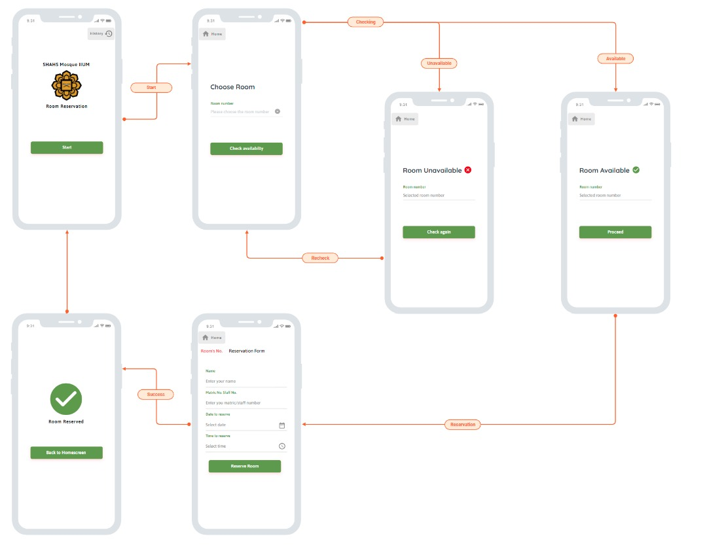
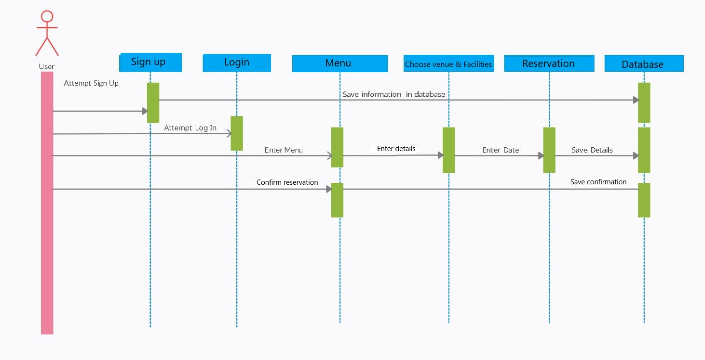
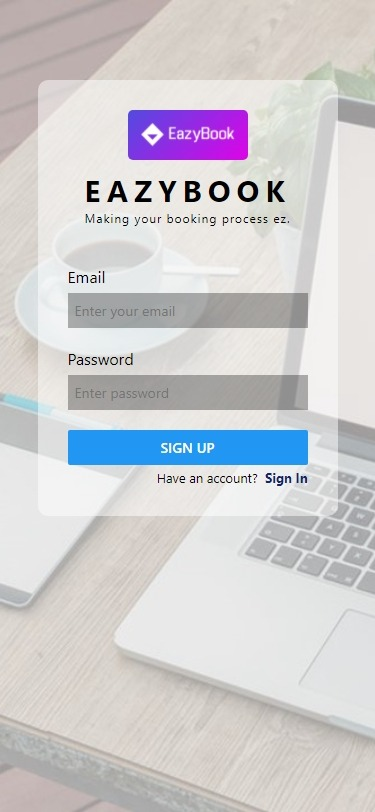
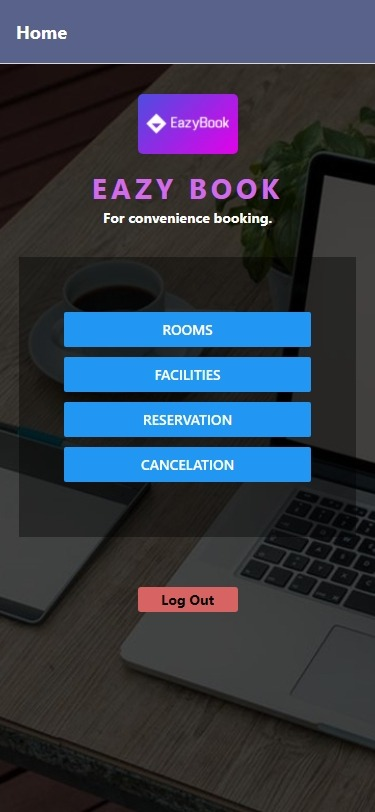
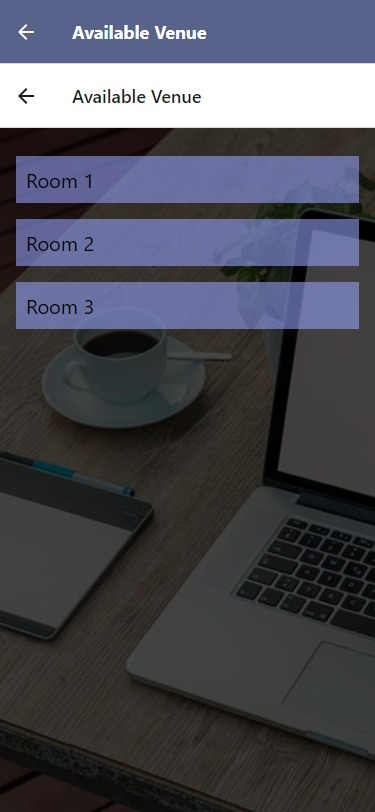
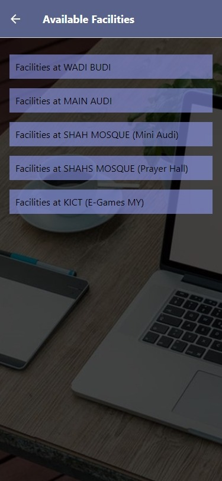
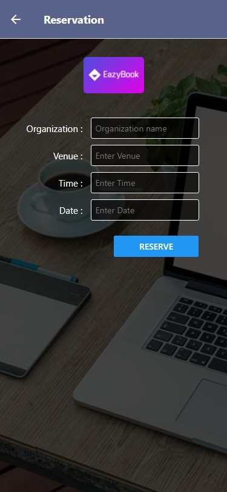
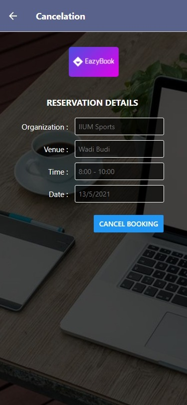

# MobileApps---Project
# Name and Matric No of the group members.
1. AHMAD SYAHRIL DANIAL BIN CHE ZAINAL 1812603
2. MOHAMMAD FITRI AIMAN BIN MOHAMMAD AZLI 1810925
3. MUHAMMAD 'AFIF HAZIM BIN MAT NAJIB 1811167
4. AHMAD NAUFAL IBAD BIN MOHD LAZIM 1910457
5. MUHAMMAD FARHAN BIN JAMAL 1611595
# EASYBOOK APP  
# Introduction of the proposed mobile application. 
As the title suggests, the apps allows the user to make reservation on any available rooms and halls within IIUM.  
The reason why we chose to build this app is to provide a platform where the user can make reservation by specifying  
which rooms or hall them want to book, their organization name, date and time. The user also can make cancellation  
prior to the reservation date if they wish to do so. Before using this app, the users are required to create an  
account and log into the apps so that apps can keeptrack all booking history made by the user. 
# Objective of the proposed mobile application.
The objective of this app consists of solving problems that the user have before the implementation of this app.  
The objectives are as follows :-  
1. To provide a platform that can make reservation easier than before.
2. To minimize the use of paperwork.
3. To efficiently handle user data via the proposed apps.
# Features and Functionalities
The features and functionalities of the app are quite straightforward, as the main premises of this app is to allow  
the user to make reservation on the available rooms within IIUM. The functions listed are as follows :-  
1. The user can register and log into the apps in order to use it.
2. Users can view any vacant room available to reserve as well as facilities such as pa system, speaker, microphone, etc.
3. Users can make room reservations by specifying the name of organization, date, and time.
4. Users can cancel their reservation prior the date of booking.
# Screen Navigation  

# Sequence Diagram  

# Apps Screen Capture
Login - Login and signup page of the app  
    
Main page - The main page of the app after the user log into the apps.  
    
View available room to book  
    
View available facilities to book  
    
Reservation - This is the page where users can make reservation  
    
Cancellation - User can make cancellation of their booking here  
    

# Challenges  
1) Encountered error during dependecies installation.
2) Network and device performance limitations during the execution of the apps.
3) Difficulty in working in an online environment.
4) Encountered error during code compilation.
